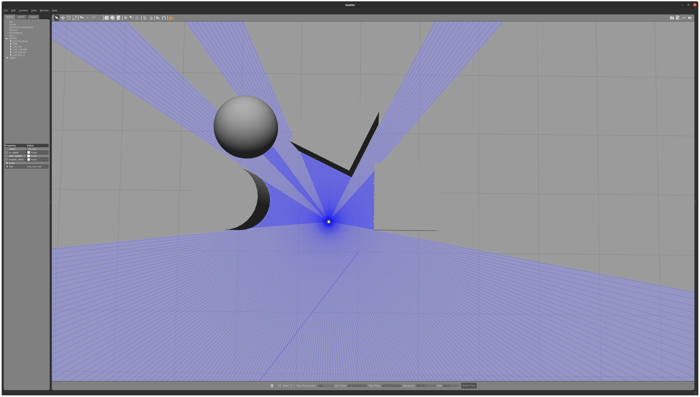
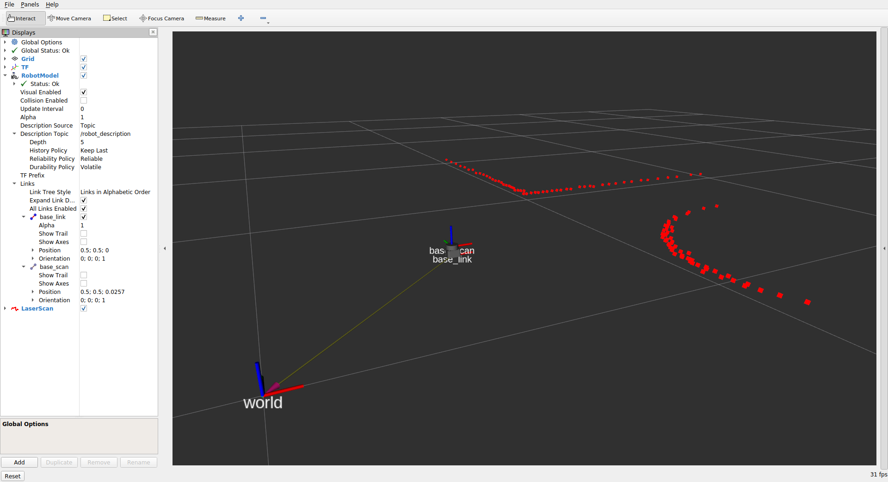
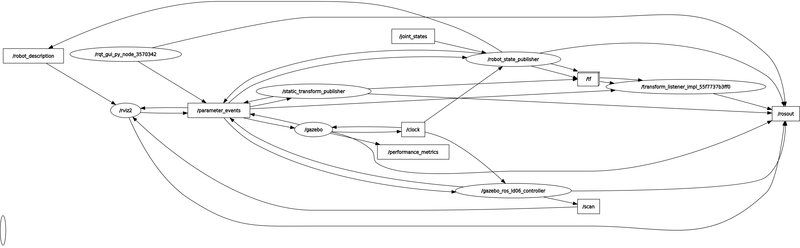

# ld06_sim

## Usage
```sh
ros2 launch ld06_sim ld06_sim.launch.py
```

Add some models in Gazebo.

### Results
#### gazebo


#### rviz


#### rqt_graph


## TODO
- Gazeboに生成するモデルへのテクスチャの設定
- LiDARによる計測対象の障害物をlaunch時に自動でGazebo環境中に生成

## Notes
rviz2上にRobotModelを表示する際はrviz側のPolicyの設定に注意．現状`Reliability Policy`について，`Best Effort`ではなく，`Reliable`を指定すると上記のようにモデルを表示できることが分かっている．

以下が原因のよう
> 両者の接続は、お互いのQoSプロファイルに互換性がある場合のみ成功します。\
[ROS 2のQoS (Quality of Service) を試す (1)](https://www.youtalk.jp/2017/05/30/ros2-qos.html)


## References
- [LD06 datasheet](https://www.inno-maker.com/wp-content/uploads/2020/11/LDROBOT_LD06_Datasheet.pdf)
- [LD06 LiDAR 3DCAD model](https://grabcad.com/library/ldrobot-ld06-360-lidar-module-raspberry-pi-mounting-bracket-1)