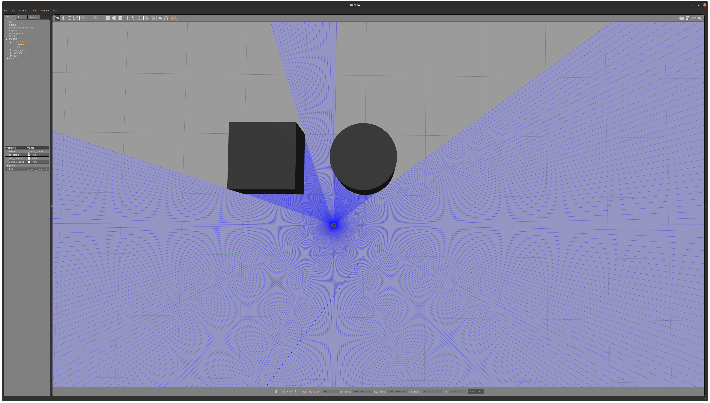

# ld06_sim

## Usage
```sh
ros2 launch ld06_sim ld06_sim.launch.py
```

Add some models in Gazebo.

### Results
#### gazebo


#### rviz


## Notes
ROS1と同様にrobot_state_publisherを用いて，rviz2にld06のモデルを表示したが，うまく表示されない．これは`/robot_description` topicがpublishされていないことが原因だと考えられる．

## References
- [LD06 datasheets](https://www.inno-maker.com/wp-content/uploads/2020/11/LDROBOT_LD06_Datasheet.pdf)
- [LD06 LiDAR 3DCAD model](https://grabcad.com/library/ldrobot-ld06-360-lidar-module-raspberry-pi-mounting-bracket-1)